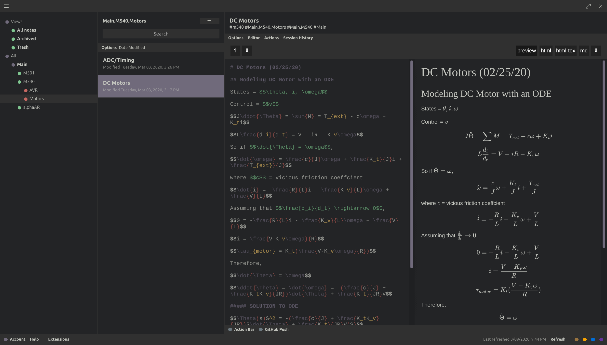

# Dark Hybrid Theme Extension for Standard Notes

## Note

This theme currently **only works on the standalone apps** for Windows, Linux and probably Mac.

### Install to Standard Notes

1) ~~In the Extensions window, click "Import Extension", and paste in this JSON endpoint:~~
(This link returns a 404 error, as of the time of forking.)
~~<https://jakecza.com/cloud/projects/sn-extensions/dark-hybrid-theme/dark-hybrid.json>~~

2) Press Enter, then accept to install

### Issues

Let me know if there are any conflicting colors or other issues with the theme on here or through [email](mailto:dev@jakecza.com)
